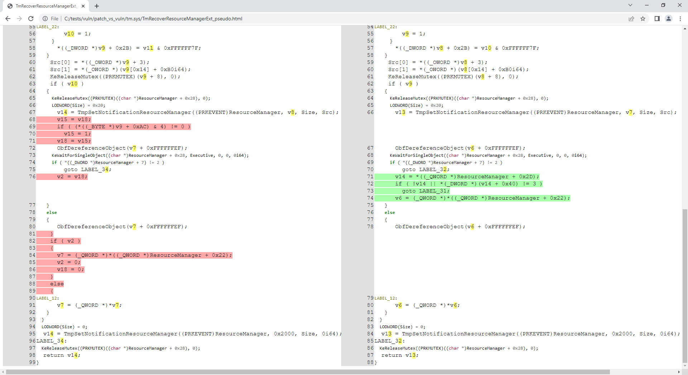

<!-- vim-markdown-toc GFM -->

* [Overview](#overview)
    * [Requirements](#requirements)
    * [Features](#features)
    * [Scripting](#scripting)
* [Usage](#usage)
    * [Simulate without executing](#simulate-without-executing)
    * [Initial analysis](#initial-analysis)
    * [Execute IDA Python script](#execute-ida-python-script)
    * [Binary diffing](#binary-diffing)
        * [Requirements](#requirements-1)
        * [Initial analysis](#initial-analysis-1)
        * [Diffing files](#diffing-files)
        * [Diffing a function](#diffing-a-function)
    * [Filters](#filters)
        * [Architecture detection](#architecture-detection)
        * [Target-specific](#target-specific)
* [Known projects using idahunt](#known-projects-using-idahunt)

<!-- vim-markdown-toc -->

# Overview

**idahunt** is a framework to analyze binaries with IDA Pro and hunt for things
in IDA Pro. It is command line tool to analyse all executable files
recursively from a given folder. It executes IDA in the background so you don't have
to open manually each file. It supports executing external IDA Python scripts.

## Requirements

* Python3 only (except IDA Python scripts which can be Python2/Python3 depending on your IDA setup)
* IDA Pro
* Windows, Linux, OS X

## Features

* Specify how many instances of IDA you want to run simultaneously
* Automate creation of IDBs for multiple executables
* Execute IDA Python scripts across multiple executables
* Open multiple existing IDBs
* Support any binary format (raw assembly/PE/ELF/MACH-O/etc.) supported by IDA
* (Optional) Include IDA Python helpers. You can use these
  to easily build your own IDA Python scripts or you can use any other IDA Python library like
  [sark](https://sark.readthedocs.io/en/latest/) or [bip](https://github.com/synacktiv/bip)
  to name a few

Useful examples include (non-exhaustive list):

* Analyse Microsoft Patch Tuesday updates
* Analyse malware of the same family
* Analyse multiple versions of the same software
* Analyse a bunch of binaries (UEFI, HP iLO, Cisco IOS router, Cisco ASA firewall, etc.)

## Scripting

IDA Python scripts capabilities are unlimited. You can import any existing IDA
Python script or build your own. Some examples:

* Rename functions based on debugging strings
* Decrypt strings (e.g. malware)
* Hunt for the same symbol across multiple versions (using heuristics)
* Hunt for ROP gadgets
* Port reversed function names / symbols from one version to another using tools like [diaphora](https://github.com/joxeankoret/diaphora)
* Etc.

# Usage

* `idahunt.py`: main tool to analyse executable files
* `filters/`: contains basic filters to decide which fiels in an input dir to analyze with IDA
    * `filters/default.py`: default basic filter not filtering anything and used by default
    * `filters/ciscoasa.py`: useful for analyzing Cisco ASA Firewall images
    * `filters/hpilo.py`: useful for analyzing HP iLO images
    * `filters/names.py`: basic filter based on name, name length or extension 
* `script_template.py`: contains a `hello world` IDA Python script

```
C:\idahunt> C:\Python37-x64\python.exe .\idahunt.py -h
usage: idahunt.py [-h] [--inputdir INPUTDIR] [--analyse] [--open]
                  [--ida-args IDA_ARGS] [--scripts SCRIPTS [SCRIPTS ...]]
                  [--filter FILTER] [--cleanup] [--temp-cleanup] [--verbose]
                  [--max-ida MAX_IDA] [--list-only] [--version IDA_VERSION]

optional arguments:
  -h, --help            show this help message and exit
  --inputdir INPUTDIR   Input folder to search for files
  --analyse, --analyze  analyse all files i.e. create .idb for all of them
  --open                open all files into IDA (debug only)
  --ida-args IDA_ARGS   Additional arguments to pass to IDA (e.g.
                        -p<processor> -i<entry_point> -b<load_addr>)
  --scripts SCRIPTS [SCRIPTS ...]
                        List of IDA Python scripts to execute in this order
  --filter FILTER       External python script with optional arguments
                        defining a filter for the names of the files to
                        analyse. See filters/names.py for example
  --cleanup             Cleanup i.e. remove .asm files that we don't need
  --temp-cleanup        Cleanup temporary database files i.e. remove .id0,
                        .id1, .id2, .nam, .dmp files if IDA Pro crashed and
                        did not delete them
  --verbose             be more verbose to debug script
  --max-ida MAX_IDA     Maximum number of instances of IDA to run at a time
                        (default: 10)
  --list-only           List only what files would be handled without
                        executing IDA
  --version IDA_VERSION
                        Override IDA version (e.g. "7.5"). This is used to
                        find the path of IDA on Windows.
```

## Simulate without executing

You can use `--list-only` with any command line to just list what the tool would
do without actually doing it.

```
C:\idahunt>idahunt.py --inputdir C:\re --analyse --filter "filters\names.py -a 32 -v" --list-only
[idahunt] Simulating only...
[idahunt] ANALYSING FILES
[idahunt] Analysing C:\re\cves\cve-2014-4076.dll
[idahunt] Analysing C:\re\cves\cve-2014-4076.exe
[idahunt] Analysing C:\re\DownloadExecute.exe
[idahunt] Analysing C:\re\ReverseShell.exe
```

## Initial analysis

Here we start an initial analysis. It finishes after a few seconds:

```
C:\idahunt>idahunt.py --inputdir C:\re --analyse --filter "filters\names.py -a 32 -v"
[idahunt] ANALYSING FILES
[idahunt] Analysing C:\re\cves\cve-2014-4076.dll
[idahunt] Analysing C:\re\cves\cve-2014-4076.exe
[idahunt] Analysing C:\re\DownloadExecute.exe
[idahunt] Analysing C:\re\ReverseShell.exe
[idahunt] Waiting on remaining 4 IDA instances
```

Here we cleanup temporary `.asm` files created by the initial analysis:

```
C:\idahunt>idahunt.py --inputdir C:\re --cleanup
[idahunt] Deleting C:\re\cves\cve-2014-4076.asm
[idahunt] Deleting C:\re\DownloadExecute.asm
[idahunt] Deleting C:\re\ReverseShell.asm
```

We can see the generated `.idb` as well as some `.log` files that contain the
IDA Pro output window.

```
C:\idahunt>tree /f C:\re
Folder PATH listing
Volume serial number is XXXX-XXXX
C:\RE
│   DownloadExecute.exe
│   DownloadExecute.idb
│   DownloadExecute.log
│   ReverseShell.exe
│   ReverseShell.idb
│   ReverseShell.log
│
└───cves
        cve-2014-4076.dll
        cve-2014-4076.exe
        cve-2014-4076.idb
        cve-2014-4076.log
```

## Execute IDA Python script

Here we execute a basic IDA Python script that prints
`[script_template] I execute in IDA, yay!` in the IDA Pro output window.

```
C:\idahunt>idahunt.py --inputdir C:\re --filter "filters\names.py -a 32 -v" --scripts C:\idahunt\script_template.py
[idahunt] EXECUTE SCRIPTS
[idahunt] Executing script C:\idahunt\script_template.py for C:\re\cves\cve-2014-4076.dll
[idahunt] Executing script C:\idahunt\script_template.py for C:\re\cves\cve-2014-4076.exe
[idahunt] Executing script C:\idahunt\script_template.py for C:\re\DownloadExecute.exe
[idahunt] Executing script C:\idahunt\script_template.py for C:\re\ReverseShell.exe
[idahunt] Waiting on remaining 4 IDA instances
```

Since it is saved in the `.log` file, we can check it successfully executed:

```
Autoanalysis subsystem has been initialized.
Database for file 'ReverseShell.exe' has been loaded.
Compiling file 'C:\Program Files (x86)\IDA 6.95\idc\ida.idc'...
Executing function 'main'...
[script_template] I execute in IDA, yay!
```

## Binary diffing

idahunt integrates beautifully with [diaphora](https://github.com/joxeankoret/diaphora) for doing binary diffing since this [PR](https://github.com/joxeankoret/diaphora/pull/246).

### Requirements

You need a hierarchy of folders with the different versions of the same filename, e.g.:

```
C:\> tree C:\tests\ /F
C:\tests
├───patch
│       tm.sys
│
└───vuln
        tm.sys
```

### Initial analysis

If not already done, you need to do the initial IDA analysis to create the idbs.

```
C:\idahunt> python idahunt.py --inputdir C:\tests\ --analyse --verbose
[idahunt] IDA32 = C:\Program Files\IDA Core 8.1\ida.exe
[idahunt] IDA64 = C:\Program Files\IDA Core 8.1\ida64.exe
[idahunt] ANALYSING FILES
[idahunt] Analysing C:\tests\patch\tm.sys
[idahunt] C:\Program Files\IDA Core 8.1\ida64.exe -B -oC:\tests\patch\tm.i64 -LC:\tests\patch\tm.log C:\tests\patch\tm.sys
[idahunt] Analysing C:\tests\vuln\tm.sys
[idahunt] C:\Program Files\IDA Core 8.1\ida64.exe -B -oC:\tests\vuln\tm.i64 -LC:\tests\vuln\tm.log C:\tests\vuln\tm.sys
[idahunt] Executed IDA 2/2 times IDA instances
[idahunt] Took 0:00:15.03 to execute this
```

```
C:\> tree C:\tests\ /F
C:\tests
├───patch
│       tm.i64
│       tm.log
│       tm.sys
│
└───vuln
        tm.i64
        tm.log
        tm.sys
```

### Diffing files

This uses diaphora to do the diff export for each file (creating the `<filename>.sqlite` sqlite3 database), and then the diff between versions (creating the `<filename>.diaphora` sqlite3 database).

```
C:\idahunt> python idahunt.py --diaphora-path C:\diaphora --inputdir C:\tests --diff --filename tm.sys --verbose
[idahunt] IDA32 = C:\Program Files\IDA Core 8.1\ida.exe
[idahunt] IDA64 = C:\Program Files\IDA Core 8.1\ida64.exe
[idahunt] EXECUTE DIFF-EXPORT
[idahunt] Executing script C:\diaphora\diaphora_ida.py for C:\tests\patch\tm.sys
[idahunt] C:\Program Files\IDA Core 8.1\ida64.exe -A -SC:\diaphora\diaphora_ida.py -LC:\tests\patch\tm.log C:\tests\patch\tm.i64
[idahunt] Environment variables:
[idahunt] DIAPHORA_AUTO2=1
[idahunt] DIAPHORA_EXPORT_FILE=tm.sqlite
[idahunt] Executing script C:\diaphora\diaphora_ida.py for C:\tests\vuln\tm.sys
[idahunt] C:\Program Files\IDA Core 8.1\ida64.exe -A -SC:\diaphora\diaphora_ida.py -LC:\tests\vuln\tm.log C:\tests\vuln\tm.i64
[idahunt] Environment variables:
[idahunt] DIAPHORA_AUTO2=1
[idahunt] DIAPHORA_EXPORT_FILE=tm.sqlite
[idahunt] Executed IDA 2/2 times IDA instances
[idahunt] EXECUTE DIFF
[idahunt] Diffing patch vs vuln
[idahunt] C:\Program Files\Python39\python.exe C:\diaphora\diaphora.py C:\tests\patch\tm.sqlite C:\tests\vuln\tm.sqlite -o C:\tests\vuln\patch_vs_vuln\tm.sys.diaphora
[diaphora][Wed Dec 14 10:33:49 2022] Diffing...es
[diaphora][Wed Dec 14 10:33:49 2022] Callgraphs from both programs differ in 0.706714%
[diaphora][Wed Dec 14 10:33:49 2022] Finding best matches...
[diaphora][Wed Dec 14 10:33:49 2022] Finding with heuristic 'Perfect match, same name'
[diaphora][Wed Dec 14 10:33:50 2022] All functions matched in at least one database, finishing.
[diaphora][Wed Dec 14 10:33:50 2022] Finding partial matches
[diaphora][Wed Dec 14 10:33:50 2022] All functions matched in at least one database, finishing.
[diaphora][Wed Dec 14 10:33:50 2022] Finding with heuristic 'Small names difference'
[diaphora][Wed Dec 14 10:33:50 2022] Finding with heuristic 'Call address sequence'
[diaphora][Wed Dec 14 10:33:50 2022] Finding with heuristic 'Call address sequence'
[diaphora][Wed Dec 14 10:33:50 2022] Finding unmatched functions
[diaphora][Wed Dec 14 10:33:50 2022] Done. Took 1.110000000000582 seconds.
[diaphora][Wed Dec 14 10:33:50 2022] Diffing results saved in file 'C:\tests\vuln\patch_vs_vuln\tm.sys.diaphora'.
[idahunt] Executed Python 1/1 times
[idahunt] Took 0:00:30.07 to execute this
```

```
C:\> tree C:\tests\ /F
C:\tests
├───patch
│       tm.i64
│       tm.log
│       tm.sqlite
│       tm.sys
│
└───vuln
    │   tm.i64
    │   tm.log
    │   tm.sqlite
    │   tm.sys
    │
    └───patch_vs_vuln
            tm.sys.diaphora
            tm.sys.txt
```

As shown above, it also creates a `<filename>.txt` file along the `<filename>.diaphora` file with the list of best matches:

```
partial,00000,1c0002708,WPP_SF_DDq,1c0002708,WPP_SF_DDq,0.950,1,1,Perfect match, same name
partial,00001,1c0002770,WPP_SF_Dq,1c0002770,WPP_SF_Dq,0.940,1,1,Perfect match, same name
partial,00002,1c00027c8,WPP_SF_qq_guid_D,1c00027c8,WPP_SF_qq_guid_D,0.960,1,1,Perfect match, same name
partial,00003,1c0002844,WPP_SF_qqi,1c0002844,WPP_SF_qqi,0.950,1,1,Perfect match, same name
partial,00004,1c00028a8,WPP_SF_qqii,1c00028a8,WPP_SF_qqii,0.960,1,1,Perfect match, same name
partial,00005,1c0015500,TmRecoverResourceManagerExt,1c0015500,TmRecoverResourceManagerExt,0.860,37,36,Perfect match, same name
partial,00006,1c001a610,TmpHeuristicAbortTransaction,1c001a640,TmpHeuristicAbortTransaction,0.986,6,6,Perfect match, same name
partial,00007,1c001a6c0,TmpHeuristicAbortTransactionAfterCheckpoint,1c001a6f0,TmpHeuristicAbortTransactionAfterCheckpoint,0.992,11,11,Perfect match, same name
partial,00008,1c001ad58,TmpIsClusteredTransactionManager,1c001ad88,TmpIsClusteredTransactionManager,0.994,15,15,Perfect match, same name
partial,00009,1c001b0c0,TmpMigrateEnlistments,1c001b0f0,TmpMigrateEnlistments,0.980,10,10,Perfect match, same name
```

### Diffing a function

It turns out the `tm.sys` files (provided in the repo) are related to [CVE-2018-8611](https://research.nccgroup.com/2020/04/27/cve-2018-8611-exploiting-windows-ktm-part-1-5-introduction/) so let's analyse the patched function `TmRecoverResourceManagerExt()`:

```
C:\idahunt> python idahunt.py --diaphora-path C:\diaphora\ --inputdir C:\tests\ --html --filename tm.sys --funcname TmRecoverResourceManagerExt --verbose
[idahunt] IDA32 = C:\Program Files\IDA Core 8.1\ida.exe
[idahunt] IDA64 = C:\Program Files\IDA Core 8.1\ida64.exe
[idahunt] EXECUTE GENERATE HTML
C:\tests\patch\tm.sqlite C:\tests\vuln\tm.sqlite
C:\tests\vuln\patch_vs_vuln\tm.sys\TmRecoverResourceManagerExt_asm.html C:\tests\vuln\patch_vs_vuln\tm.sys\TmRecoverResourceManagerExt_pseudo.html
[idahunt] Showing patch vs vuln for TmRecoverResourceManagerExt
[idahunt] C:\Program Files\IDA Core 8.1\ida64.exe -A -SC:\diaphora\diaphora_ida.py -LC:\tests\patch\tm.log C:\tests\patch\tm.i64
[idahunt] Environment variables:
[idahunt] DIAPHORA_AUTO4=1
[idahunt] DIAPHORA_DB1=C:\tests\patch\tm.sqlite
[idahunt] DIAPHORA_DB2=C:\tests\vuln\tm.sqlite
[idahunt] DIAPHORA_DIFF=C:\tests\vuln\patch_vs_vuln\tm.sys.diaphora
[idahunt] DIAPHORA_EA1=1c0015500
[idahunt] DIAPHORA_EA2=1c0015500
[idahunt] DIAPHORA_HTML_ASM=C:\tests\vuln\patch_vs_vuln\tm.sys\TmRecoverResourceManagerExt_asm.html
[idahunt] DIAPHORA_HTML_PSEUDO=C:\tests\vuln\patch_vs_vuln\tm.sys\TmRecoverResourceManagerExt_pseudo.html
[idahunt] Executed IDA 1/1 times IDA instances
[idahunt] Took 0:00:10.03 to execute this
```

Now we have generated assembly and decompiled code for this function:

```
C:\idahunt> tree C:\tests\ /F
C:\tests
├───patch
│       tm.i64
│       ...
│
└───vuln
    │   tm.i64
    │   ...
    │
    └───patch_vs_vuln
        │   tm.sys.diaphora
        │   tm.sys.txt
        │
        └───tm.sys
                TmRecoverResourceManagerExt_asm.html
                TmRecoverResourceManagerExt_pseudo.html
```



## Filters

We can filter that idahunt only analyses files with a given pattern in the name
(`-n Download` below):

```
C:\idahunt>idahunt.py --inputdir C:\re --filter "filters\names.py -a 32 -v -n Download" --scripts C:\idahunt\script_template.py --list-only
[idahunt] Simulating only...
[idahunt] EXECUTE SCRIPTS
[names] Skipping non-matching name Download in cve-2014-4076.dll
[names] Skipping non-matching name Download in cve-2014-4076.exe
[idahunt] Executing script C:\idahunt\script_template.py for C:\re\DownloadExecute.exe
[names] Skipping non-matching name Download in ReverseShell.exe
```

We can also filter that idahunt only analyses files with a given
extension (`-e dll` below):

```
C:\idahunt>idahunt.py --inputdir C:\re --filter "filters\names.py -a 32 -v -e dll" --scripts C:\idahunt\script_template.py --list-only
[idahunt] Simulating only...
[idahunt] EXECUTE SCRIPTS
[idahunt] Executing script C:\idahunt\script_template.py for C:\re\cves\cve-2014-4076.dll
[names] Skipping non-matching extension .dll in cve-2014-4076.exe
[names] Skipping non-matching extension .dll in DownloadExecute.exe
[names] Skipping non-matching extension .dll in ReverseShell.exe
```

### Architecture detection

The architecture is required to know in advance due to IDA Pro architecture and the fact
that it contains 2 different executables `idaq.exe` and `idaq64.exe` to analyse
binaries of the two architectures 32-bit and 64-bit. This is especially true if you want to
use the HexRays decompiler.

idahunt will automatically detect i386, ia64 and amd64 architectures in Windows PE files.
If you need to automatically detect other architectures, you can create an issue or add it 
to idahunt and do a PR.

If you forget to provide the architecture of the files you want to analyse, the
basic `filters\names.py` will return an error:

```
C:\idahunt>idahunt.py --inputdir C:\re --filter "filters\names.py -v -e dll" --scripts C:\idahunt\script_template.py --list-only
[idahunt] Simulating only...
[idahunt] EXECUTE SCRIPTS
[names] Unknown architecture: None. You need to specify it with -a
[names] Skipping non-matching extension .dll in cve-2014-4076.exe
[names] Skipping non-matching extension .dll in DownloadExecute.exe
[names] Skipping non-matching extension .dll in ReverseShell.exe
```

### Target-specific

There are filters for analyzing HP iLO or Cisco ASA firmware.

# Known projects using idahunt

* [asadbg](https://github.com/nccgroup/asadbg)
